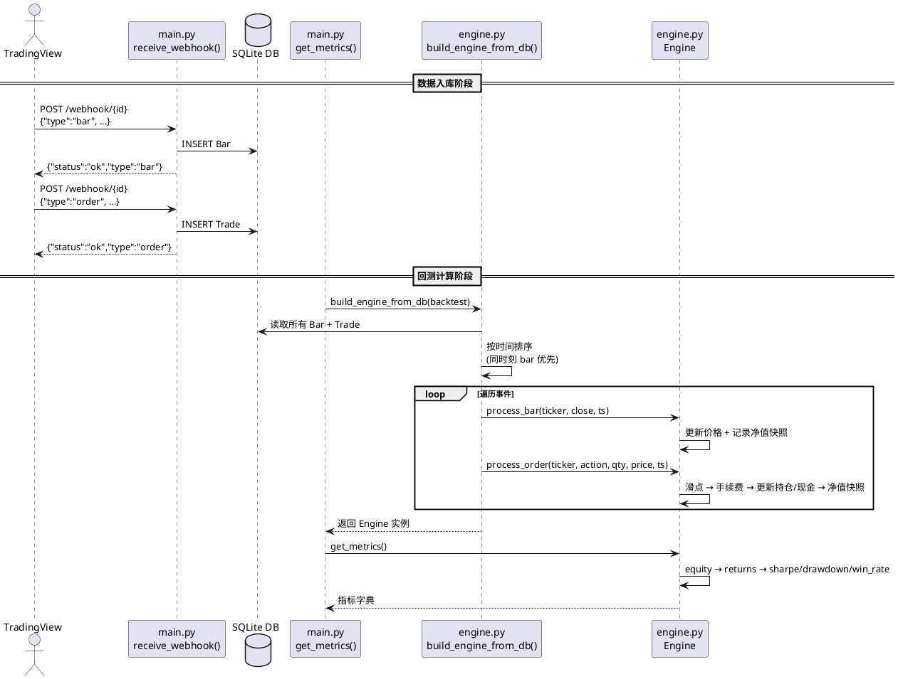
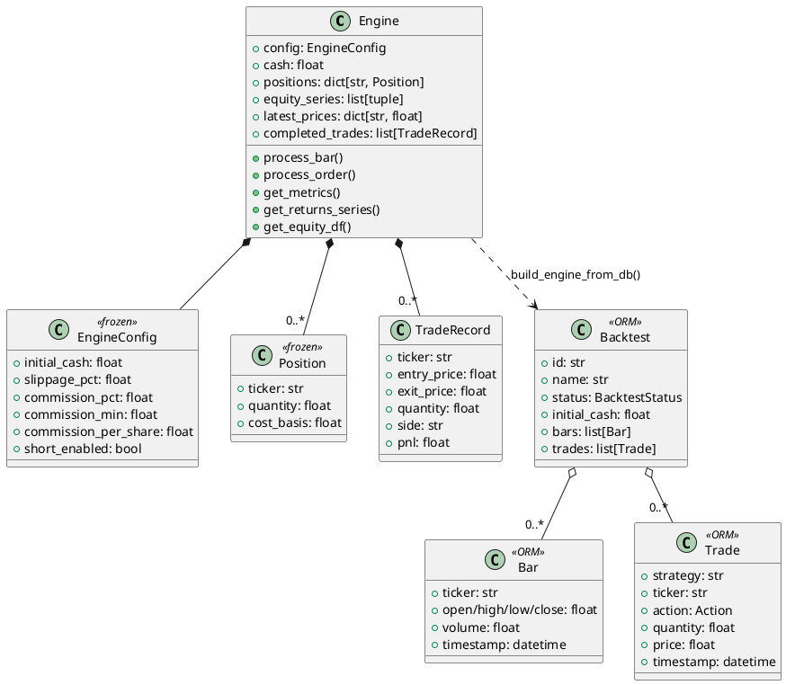

# 探索日志：一个 TradingView webhook 信号从被接收到完成回测计算，经历了哪些步骤？

## 调用链

[1] src/portfolio_backtest/main.py:262 → `receive_webhook()`
-> 接收 webhook 请求，根据 type 字段分发：bar 存为 Bar，order 存为 Trade，写入 DB
-> 入参: `{"type":"order","strategy":"ma_cross","ticker":"AAPL","action":"buy","quantity":10,"price":150.0,"timestamp":"..."}`
-> 输出: `{"status":"ok","type":"order","ticker":"AAPL","action":"buy"}`

[2] src/portfolio_backtest/engine.py:256 → `build_engine_from_db()`
-> 从 DB 读取 Backtest 的所有 Bar 和 Trade，合并为事件列表按时间排序（同一时刻 bar 在 order 前），逐条回放到 Engine
-> 入参: Backtest ORM 对象（含 bars 和 trades 关系）
-> 输出: 回放完毕的 Engine 实例

[3] src/portfolio_backtest/engine.py:67 → `Engine.process_bar()`
-> 更新 ticker 最新价格，计算当前组合总价值并追加到 equity_series
-> 入参: process_bar("AAPL", 155, t3)，当前 cash=90000, 持有 AAPL 100 股
-> 输出: equity_series 追加 (t3, 90000+100×155) = (t3, 105500)

[4] src/portfolio_backtest/engine.py:71 → `Engine.process_order()`
-> 应用滑点计算实际成交价，计算手续费，根据 action 分发到 _apply_buy/_apply_sell/_apply_short/_apply_cover 更新持仓和现金
-> 入参: process_order("AAPL", "buy", 100, 150.0, t2)，slippage=0.1%, commission=0.1%
-> 输出: 滑点后价格 150.15，手续费 15.015，cash 减少至 84969.985，持仓 AAPL quantity=100 cost_basis=150.15

[5] src/portfolio_backtest/engine.py:166 → `Engine.get_metrics()`
-> 基于 equity_series 计算年化收益、夏普率、Sortino、最大回撤、胜率、盈亏比等指标
-> 入参: 回放完毕的 Engine 实例
-> 输出: `{"total_return":1500,"total_return_pct":1.5,"sharpe_ratio":...,"max_drawdown_pct":-0.015,"win_rate":100.0,...}`

## 时序图

## 类依赖关系

